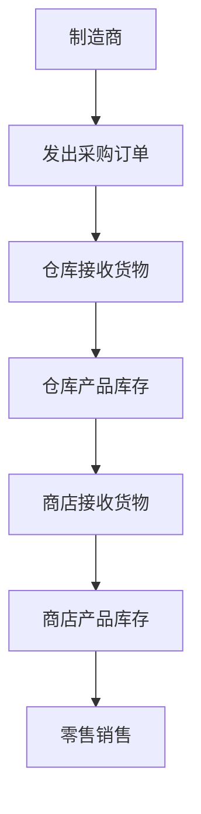
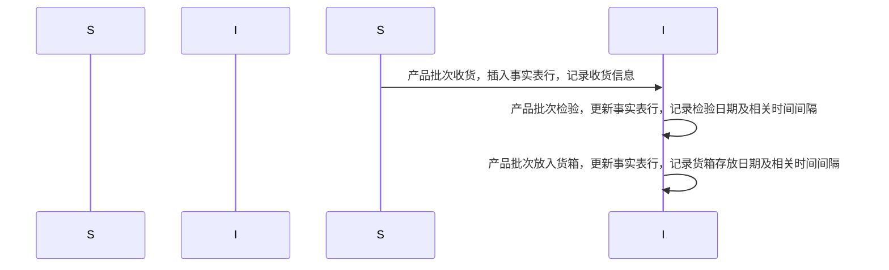

# 第4章 库存 (Inventory)

## 4.1 价值链介绍 (Value Chain Introduction)

### 价值链介绍
大多数组织都有一条由关键业务流程构成的潜在价值链。价值链确定了组织主要活动的自然、逻辑流程。例如，零售商向产品制造商发出采购订单。产品被送到零售商的仓库，在那里作为库存储存。然后再运送到单个商店，产品在商店里再次作为库存存放，直到消费者购买。图4-1展示了零售商价值链的这一部分。显然，从制造商直接发货到零售商店的产品会绕过仓储流程。

图4-1：零售商价值链的一部分

运营源系统通常在价值链的每个步骤中生成事务或快照。大多数分析型数据仓库/商业智能（DW/BI）系统的主要目标是监控这些关键流程的绩效结果。由于每个流程在不同的时间间隔、以不同的粒度和维度生成独特的指标，因此每个流程通常会生成一个或多个事实表。为此，价值链为企业DW/BI环境的整体数据架构提供了高层次的见解。我们将在本章后面的 “价值链集成” 部分进一步讨论这个话题。 

## 4.2 库存模型 (Inventory Models)
与此同时，我们将讨论几种互补的库存模型。第一种是库存定期快照模型，在该模型中，产品库存水平会在固定间隔进行测量，并作为单独的行记录在事实表中。随着时间的推移，这些定期快照行在维度模型中呈现为一系列数据层，就像地质层代表了长时间内沉积物的积累一样。接下来，我们将讨论第二种库存模型，在产品进出仓库的过程中，每一个影响库存水平的交易都会被记录下来。最后，在第三种模型中，我们将描述库存累积快照模型，即每次产品交付时，都会在事实表中插入一行记录，然后随着产品在仓库中的流转，该行会被更新。每个模型都讲述了不同的情况。对于某些分析需求，可能同时需要两个甚至三个模型。 
### 4.2.1 库存周期快照 (Inventory Periodic Snapshot)

让我们回到零售案例研究。优化商店的库存水平对连锁企业的盈利能力有着重大影响。确保在正确的时间、正确的商店有正确的产品，能最大程度减少缺货情况（产品在货架上无货可售），并降低整体库存持有成本。零售商希望按产品和商店分析每日库存水平。

现在是时候再次运用四步维度设计流程了。我们感兴趣的分析业务流程是零售商店库存的定期快照。运营库存系统提供的最细粒度的细节是每个商店中每种产品的每日库存。从这个粒度声明中可以直接得出维度：日期、产品和商店。对于定期快照事实表来说，这种情况经常发生，因为你无法在交易的背景下表达粒度，所以需要列出维度。在这个案例研究中，在这个粒度下没有其他描述性维度。例如，促销维度通常与产品流动相关，比如产品订购、接收或销售时，但与库存无关。

最简单的库存视图只涉及一个事实：现有库存数量。这就产生了一个非常简洁的维度设计，如图4-2所示。

本案例研究中的日期维度表与第3章中为零售商店销售开发的表相同。产品和商店维度可能会添加对库存分析有用的其他属性。例如，假设每个产品的最小再订购数量或存储要求是常量且离散的描述符，那么产品维度可以添加这些列。如果某产品的最小再订购数量因商店而异，则不能将其作为产品维度属性。在商店维度中，你可能会添加属性来标识冷冻和冷藏存储面积。

即使是像图4-2这样简单的模式也非常有用。如果对许多地点的许多产品频繁测量库存水平，就可以获得许多有价值的见解。然而，这个定期快照事实表面临着第3章的销售交易事实表没有的严重挑战。销售事实表的稀疏度比较合理，因为并非每个购物车都会购买每种产品。另一方面，库存会生成密集的快照表。由于零售商努力避免缺货情况，可能每天每个商店的每种产品在事实表中都有一行记录。在这种情况下，你需要将缺货时数量为零的测量值作为明确的行包含在内。对于一家在100家商店中库存有60,000种产品的杂货店零售商来说，每晚加载事实表时大约会插入600万行（60,000种产品×100家商店）。不过，由于每行宽度仅为14字节，每次加载事实表只会增加84MB的大小。

虽然在这种情况下数据量是可管理的，但某些定期快照的密集度可能需要做出一些妥协。最明显的可能是随着时间推移减少快照频率。将最近60天的库存保持在每日粒度，然后对历史数据采用粒度较低的每周快照可能是可以接受的。这样，在3年期间，快照数量可以从1095个减少到总共208个；60个每日快照和148个每周快照应存储在两个单独的事实表中，因为它们的周期不同。 

半加性事实
Semi-Additive Facts
我们在第3章中强调了事实可加性的重要性。在库存快照模式中，现有库存数量可以按产品或商店进行汇总，得出有效的总计。然而，库存水平在不同日期之间不可相加，因为它们代表的是某一时刻的水平或余额的快照。由于库存水平（以及所有形式的财务账户余额）在某些维度上可加，但并非在所有维度上都可加，我们将它们称为半加性事实。

如果你考虑自己的支票账户余额，库存余额事实的半加性就更容易理解了。假设周一你的账户中有50美元。周二，余额保持不变。周三，你又存入50美元，所以余额现在是100美元。直到周末，该账户没有进一步的活动。到了周五，你不能简单地把这一周的每日余额相加，然后宣称最终余额是400美元（基于50 + 50 + 100 + 100 + 100）。跨日期合并账户余额和库存水平最有用的方法是取平均值（在这个支票账户的例子中，平均余额为80美元）。你可能很熟悉银行在每月账户对账单中提到的日均余额。

注意：所有记录静态水平的度量（库存水平、财务账户余额以及诸如室温之类的强度度量）本质上在日期维度以及可能的其他维度上是不可加的。在这些情况下，可以通过在时间段数量上取平均值来跨日期聚合度量。

不幸的是，你不能使用SQL的AVG函数来计算随时间的平均值。该函数对查询收到的所有行取平均，而不仅仅是日期数量。例如，如果一个查询请求在七个日期内三个产品在四个商店中的平均库存（例如，某一地理区域内一个品牌在一周内的日均库存），SQL的AVG函数会将库存总和除以84（3个产品×4家商店×7个日期）。显然，正确的答案是将库存总和除以7，即每日时间段的数量。

OLAP产品提供了在多维数据集中定义聚合规则的能力，因此，如果数据是通过OLAP多维数据集部署的，像余额这样的半加性度量就不那么成问题了。 

Enhanced Inventory Facts
### 增强型库存事实
定期库存快照事实表中的简单视图能让你看到库存水平的时间序列。对于大多数库存分析而言，仅有现有库存数量是不够的。现有库存数量需要与其他事实结合使用，以衡量库存周转速度，并得出其他有趣的指标，如库存周转率和库存可供天数。

如果在每个事实行中添加已售数量（或者，对于仓库位置而言，等同于已发货数量），就可以计算库存周转率和库存可供天数。对于每日库存快照，每日的库存周转率计算方法是已售数量除以现有库存数量。在较长时间段（如一年）内，库存周转率是总已售数量除以日均现有库存数量。库存可供天数的计算方法类似。在一段时间内，库存可供天数是期末现有库存数量除以平均每日已售数量 。

除了已售数量，库存分析师还对库存成本的扩展价值以及最新售价的价值感兴趣。图4-3展示了经过补充后的初始定期快照。
```mermaid
erDiagram
    DATE_DIMENSION ||--o{ STORE_INVENTORY_SNAPSHOT_FACT : "关联"
    PRODUCT_DIMENSION ||--o{ STORE_INVENTORY_SNAPSHOT_FACT : "关联"
    STORE_DIMENSION ||--o{ STORE_INVENTORY_SNAPSHOT_FACT : "关联"
    DATE_DIMENSION {
        date_key (PK)
        -- 日期维度相关属性
    }
    PRODUCT_DIMENSION {
        product_key (PK)
        -- 产品维度相关属性
    }
    STORE_DIMENSION {
        store_key (PK)
        -- 商店维度相关属性
    }
    STORE_INVENTORY_SNAPSHOT_FACT {
        date_key (FK)
        product_key (FK)
        store_key (FK)
        quantity_on_hand
        quantity_sold
        inventory_dollar_value_at_cost
        inventory_dollar_value_at_latest_selling_price
    }
```
图4-3：增强型库存定期快照

请注意，现有库存数量是半加性的，但增强型定期快照中的其他度量都是完全可加的。已售数量已汇总到快照的每日粒度。估值列是扩展的、可加的金额。在一些定期快照库存模式中，存储期初余额、库存变化量（delta）以及期末余额是很有用的。在这种情况下，余额同样是半加性的，而变化量在所有维度上都是完全可加的。

定期快照是最常见的库存模式。我们将简要讨论另外两种互补的视角，它们与刚刚设计的库存快照相互补充。为了换个角度，我们不再以零售商店库存为例来描述这些模型，而是沿着价值链向上，讨论仓库中的库存。 


### 4.2.2 库存事务 (Inventory Transactions)
对库存业务流程进行建模的第二种方法是记录影响库存的每一笔事务。仓库中的库存事务可能包括以下内容：
- 接收产品。
- 将产品放入检验暂存区。
- 从检验暂存区释放产品。
- 由于检验不合格将产品退回供应商。
- 将产品放入货箱。
- 从货箱中取出产品。
- 包装产品以便发货。
- 将产品发货给客户。
- 从客户处接收产品。
- 将客户退回的产品重新放入库存。
- 从库存中移除产品。

每笔库存事务都会确定日期、产品、仓库、供应商、事务类型，并且在大多数情况下，会有一个代表事务对库存数量影响的单一数量。假设事实表的粒度是每笔库存事务一行，那么生成的模式如图4-4所示。
```mermaid
erDiagram
    DATE_DIMENSION ||--o{ WAREHOUSE_INVENTORY_TRANSACTION_FACT : "关联"
    PRODUCT_DIMENSION ||--o{ WAREHOUSE_INVENTORY_TRANSACTION_FACT : "关联"
    WAREHOUSE_DIMENSION ||--o{ WAREHOUSE_INVENTORY_TRANSACTION_FACT : "关联"
    INVENTORY_TRANSACTION_TYPE_DIMENSION ||--o{ WAREHOUSE_INVENTORY_TRANSACTION_FACT : "关联"
    DATE_DIMENSION {
        date_key (PK)
        -- 日期维度相关属性
    }
    PRODUCT_DIMENSION {
        product_key (PK)
        -- 产品维度相关属性
    }
    WAREHOUSE_DIMENSION {
        warehouse_key (PK)
        warehouse_number (NK)
        warehouse_name
        warehouse_address
        warehouse_city
        warehouse_city_state
        warehouse_state
        warehouse_zip
        warehouse_zone
        warehouse_total_square_footage
    }
    INVENTORY_TRANSACTION_TYPE_DIMENSION {
        inventory_transaction_type_key (PK)
        inventory_transaction_type_description
        inventory_transaction_type_group
    }
    WAREHOUSE_INVENTORY_TRANSACTION_FACT {
        date_key (FK)
        product_key (FK)
        warehouse_key (FK)
        inventory_transaction_type_key (FK)
        inventory_transaction_number (DD)
        inventory_transaction_dollar_amount
    }
```
图4-4：仓库库存事务模型

尽管事务事实表很简单，但它包含了反映单个库存操作的详细信息。事务事实表对于衡量特定事务类型的频率和时间安排很有用，可以回答粒度较粗的定期快照无法回答的问题。

即便如此，将事务事实表作为分析库存绩效的唯一基础并不实际。虽然从理论上讲，可以从已知的库存位置向前滚动所有可能的事务，以重建任意时刻的确切库存状况，但对于跨越日期、产品、仓库或供应商的广泛分析问题来说，这样做过于繁琐且不切实际。

注意：要记住，事务并非生活的全部。某种形式的快照表能提供对流程更全面的累积视图，通常能与事务事实表相互补充。

在结束对事务事实表的讨论之前，我们的示例假设影响库存水平的每种事务类型在维度上都是一致的：日期、产品、仓库、供应商和事务类型。我们认识到，在现实世界中，某些事务类型的维度可能会有所不同。例如，发货人可能与仓库的收货和发货相关；客户信息可能与发货和客户退货相关。如果事务的维度因事件而异，那么应该设计一系列相关的事实表，而不是将所有库存事务都捕获到单个事实表中。

注意：如果绩效度量具有不同的自然粒度或维度，它们很可能来自不同的流程，应该分别建模为不同的事实表。 
### 4.2.3 库存累积快照 (Inventory Accumulating Snapshot)
最后一种库存模型是累积快照。累积快照事实表用于具有明确开始、明确结束以及其间可识别的里程碑的流程。在这种库存模型中，当特定产品在仓库收到时，会在事实表中插入一行。在该产品离开仓库之前，会在这一事实行上跟踪其处置情况。在本示例中，只有当你能够可靠地区分不同批次收到的产品时，累积快照模型才可行；如果你通过产品序列号或批次号跟踪产品移动，这种模型也适用。

现在假设一批产品在仓库中的库存水平记录了一系列明确的事件或里程碑，如收货、检验、货箱存放和发货。如图4-5所示，包含众多日期和事实的库存累积快照事实表看起来与事务型或定期快照模式有很大不同。
```mermaid
erDiagram
    DATE_RECEIVED_DIMENSION ||--o{ INVENTORY_RECEIPT_ACCUMULATING_FACT : "关联"
    DATE_INSPECTED_DIMENSION ||--o{ INVENTORY_RECEIPT_ACCUMULATING_FACT : "关联"
    DATE_BIN_PLACEMENT_DIMENSION ||--o{ INVENTORY_RECEIPT_ACCUMULATING_FACT : "关联"
    DATE_INITIAL_SHIPMENT_DIMENSION ||--o{ INVENTORY_RECEIPT_ACCUMULATING_FACT : "关联"
    DATE_LAST_SHIPMENT_DIMENSION ||--o{ INVENTORY_RECEIPT_ACCUMULATING_FACT : "关联"
    PRODUCT_DIMENSION ||--o{ INVENTORY_RECEIPT_ACCUMULATING_FACT : "关联"
    WAREHOUSE_DIMENSION ||--o{ INVENTORY_RECEIPT_ACCUMULATING_FACT : "关联"
    VENDOR_DIMENSION ||--o{ INVENTORY_RECEIPT_ACCUMULATING_FACT : "关联"
    DATE_RECEIVED_DIMENSION {
        date_received_key (PK)
        -- 收货日期维度相关属性
    }
    DATE_INSPECTED_DIMENSION {
        date_inspected_key (PK)
        -- 检验日期维度相关属性
    }
    DATE_BIN_PLACEMENT_DIMENSION {
        date_bin_placement_key (PK)
        -- 货箱存放日期维度相关属性
    }
    DATE_INITIAL_SHIPMENT_DIMENSION {
        date_initial_shipment_key (PK)
        -- 首次发货日期维度相关属性
    }
    DATE_LAST_SHIPMENT_DIMENSION {
        date_last_shipment_key (PK)
        -- 末次发货日期维度相关属性
    }
    PRODUCT_DIMENSION {
        product_key (PK)
        -- 产品维度相关属性
    }
    WAREHOUSE_DIMENSION {
        warehouse_key (PK)
        -- 仓库维度相关属性
    }
    VENDOR_DIMENSION {
        vendor_key (PK)
        -- 供应商维度相关属性
    }
    INVENTORY_RECEIPT_ACCUMULATING_FACT {
        product_lot_receipt_number (DD)
        date_received_key (FK)
        date_inspected_key (FK)
        date_bin_placement_key (FK)
        date_initial_shipment_key (FK)
        date_last_shipment_key (FK)
        product_key (FK)
        warehouse_key (FK)
        vendor_key (FK)
        quantity_received
        quantity_inspected
        quantity_placed_in_bin
        quantity_returned_to_vendor
        quantity_shipped_to_customer
        quantity_returned_by_customer
        quantity_returned_to_inventory
        quantity_damaged
        receipt_to_inspected_lag
        receipt_to_bin_placement_lag
        receipt_to_initial_shipment_lag
        initial_to_last_shipment_lag
    }
```
图4-5：仓库库存累积快照

累积快照事实表会在产品批次经过多个日期值外键代表的标准里程碑时，提供该批次的最新状态。如图4-6所示，在一批产品从仓库完全耗尽之前，每个累积快照事实表行都会被反复更新。

图4-6：累积快照事实行的演变 

## 4.3 事实表类型 (Fact Table Types)
事实表仅有三种基本类型：事务型、周期快照型和累积快照型。令人惊讶的是，无论处于哪个行业，这种简单的模式都适用。这三种类型都有其作用；通常需要两个互补的事实表才能全面了解业务情况，然而这三种事实表的管理方式和更新节奏却大不相同。图4-7对它们的差异进行了比较和对比。
|类型|事务型|周期快照型|累积快照型|
|----|----|----|----|
|周期性|离散的事务时间点|在规则、可预测的时间间隔进行重复快照|不断演变的流程/工作流的不确定时间跨度|
|粒度|每个事务或事务行1行|每个快照周期加其他维度1行|每个流程实例1行|
|日期维度|事务日期|快照日期|流程关键里程碑的多个日期|
|事实|事务绩效|时间间隔内的累积绩效|流程实例的绩效|
|事实表稀疏度|稀疏或密集，取决于活动情况|可预测的密集|稀疏或密集，取决于流程实例|
|事实表更新|除非纠错，否则不更新|除非纠错，否则不更新|每当流程活动发生时更新|

图4-7：事实表类型比较 

### 4.3.1 事务事实表 (Transaction Fact Tables)
对企业运营最基本的观察视角是在单个事务或事务行层面。这些事实表代表在某个瞬间发生的事件。只有当事务事件发生时，事实表中才会存在与特定客户或产品相关的行。相反，一个给定的客户或产品很可能会关联到事实表中的多行，因为希望客户或产品参与不止一次的事务。
事务数据很容易融入维度框架。原子事务数据是最自然的维度数据，能让你极其详细地分析行为。一旦事务记录到事实表中，通常就不会再对其进行修改。
在充分阐述了事务细节的价值后，你可能会想，只要有一台强大快速的服务器来处理繁杂的事务细节，工作就完成了。不幸的是，即便有事务级别的数据，仅靠这些细节也难以回答一些业务问题。如前所述，不能只依赖事务数据。

### 4.3.2 周期快照事实表 (Periodic Snapshot Fact Tables)
需要通过周期快照来查看企业在规律、可预测的时间间隔内的累积绩效。与事务事实表不同，事务事实表是为每个事件发生加载一行数据，而周期快照则是在一天、一周或一个月结束时对活动进行 “拍照”（因此有 “快照” 这一术语），然后在下一个周期结束时再拍一张，依此类推。这些周期快照会连续堆叠到事实表中。周期快照事实表通常是唯一能轻松获取纵向绩效趋势的规律、可预测视图的地方。
当事务等同于小额收入时，你可以通过简单地累加事务轻松地从单个事务过渡到每日快照。在这种情况下，周期快照代表了一个时间段内事务活动的汇总；只有在出于性能考虑有需求时，才会构建该快照。在这种情况下，快照表的设计与它的事务表 “同伴” 的设计密切相关。这些事实表共享许多维度表；通常，快照表的维度总数较少。相反，汇总的周期快照表中的事实通常比事务表中的更多，因为在该时间段内发生的任何活动都可以作为周期快照中的一个指标。
然而，在许多企业中，事务细节并不容易汇总以呈现管理绩效指标。正如在这个库存案例研究中看到的，梳理事务极其耗时，而且假设你能获取所需的历史数据，解释不同类型事务对库存水平的影响所需的逻辑可能极其复杂。周期快照再次发挥作用，为管理层提供库存水平的快速、灵活视图。希望这个快照模式的数据直接来自处理这些复杂计算的运营系统。如果不是这样，ETL 系统也必须实施这种复杂的逻辑，以正确解释每种事务类型的影响。
### 4.3.3 累积快照事实表 (Accumulating Snapshot Fact Tables)
最后但同样重要的是，第三种事实表类型是累积快照。尽管它可能不像其他两种事实表类型那么常见，但累积快照能提供深刻的见解。累积快照代表具有明确开始和结束，以及一系列标准中间流程步骤的过程。当业务用户想要进行工作流或流程分析时，累积快照最为适用。
累积快照总是有多个日期外键，代表可预测的主要事件或流程里程碑；有时还会有一个额外的日期列，指示快照行的最后更新时间。正如我们将在第 6 章 “订单管理” 中讨论的，这些日期都由角色扮演日期维度来处理。由于在首次加载事实行时，大多数这些日期是未知的，因此对于未定义的日期会使用默认的代理日期键。

Lags Between Milestones and Milestone Counts
里程碑之间的时间间隔和里程碑计数
由于累积快照常常反映工作流或流程的效率以及所耗费的时间，事实表通常会包含代表关键里程碑之间持续时间或时间间隔的指标。使用事务事实表来回答有关持续时间的问题会很困难，因为你需要关联不同行的数据来计算时间间隔。有时，时间间隔指标仅仅是里程碑日期或时间戳之间的原始差值。在其他情况下，考虑到工作日和节假日，时间间隔的计算会变得更加复杂。

累积快照事实表有时会包含里程碑完成计数器，其值为0或1。最后，累积快照通常有一个指向状态维度的外键，该外键会进行更新以反映流程的最新状态。 

Accumulating Snapshot Updates and OLAP Cubes
累积快照更新和OLAP多维数据集
与其他事实表类型形成鲜明对比的是，人们会特意回访累积快照事实表的行并对其进行更新。与保留先前快照的周期快照不同，累积快照仅反映最新的状态和指标。累积快照并不试图处理不常发生的复杂场景。对这些异常情况的分析始终可以使用事务事实表来完成。

值得注意的是，累积快照通常不适合用于OLAP多维数据集。因为对累积快照的更新会导致事实和维度外键都发生变化，所以除非在流程实例完成后才加载事实行，否则对这些快照的更新会导致多维数据集的大部分内容需要重新处理。 


### 4.3.4 互补的事实表类型 (Complementary Fact Table Types)
有时，累积快照和周期快照会协同工作。例如，在构建每月快照时，可以通过将每天事务的影响添加到滚动的累积快照中，同时在周期快照中存储 36 个月的历史数据。理想情况下，当到达一个月的最后一天时，累积快照直接成为时间序列中新的常规月份数据，第二天再开始一个新的累积快照。
事务和快照是维度设计的两个重要方面。配套使用事务事实表和快照事实表，能全面展示业务情况。这两种事实表都不可或缺，因为通常无法简单地将这两种不同视角整合到单个事实表中。尽管事务表和快照表之间存在一定的数据冗余，但作为数据仓库 / 商业智能（DW/BI）的构建者，不必对此感到抵触，因为使命是发布数据，以便组织能够有效地进行分析。这些不同类型的事实表从不同角度展示同一业务情况。令人惊讶的是，本书中描述的各种用例，只需要这三种事实表类型即可满足需求。

## 4.4 价值链整合 (Value Chain Integration)
### 4.4.1 企业数据仓库总线架构 (Enterprise Data Warehouse Bus Architecture)
### 4.4.2 理解总线架构 (Understanding the Bus Architecture)
### 4.4.3 企业数据仓库总线矩阵 (Enterprise Data Warehouse Bus Matrix)

## 4.5 一致性维度 (Conformed Dimensions)
### 4.5.1 跨事实表钻取 (Drilling Across Fact Tables)
### 4.5.2 完全一致的一致性维度 (Identical Conformed Dimensions)
### 4.5.3 具有属性子集的收缩汇总一致性维度 (Shrunken Rollup Conformed Dimension with Attribute Subset)
### 4.5.4 具有行子集的收缩一致性维度 (Shrunken Conformed Dimension with Row Subset)
### 4.5.5 总线矩阵上的收缩一致性维度 (Shrunken Conformed Dimensions on the Bus Matrix)
### 4.5.6 有限的一致性 (Limited Conformity)
### 4.5.7 数据治理与数据管理的重要性 (Importance of Data Governance and Stewardship)
### 4.5.8 一致性维度与敏捷运动 (Conformed Dimensions and the Agile Movement)

## 4.6 一致性事实 (Conformed Facts)

## 4.7 总结 (Summary)