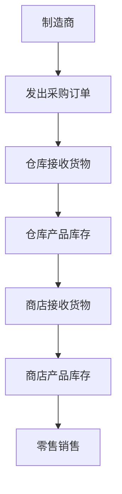
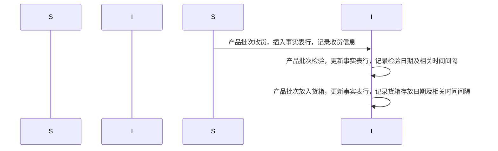
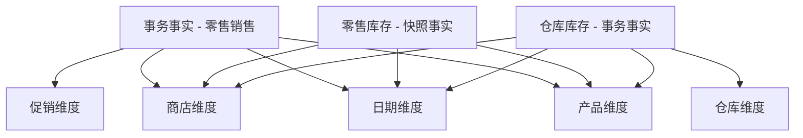
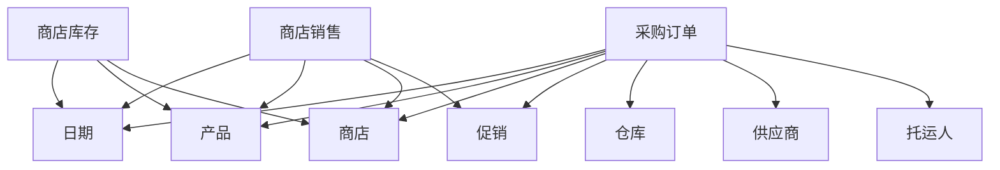

# 第4章 库存 (Inventory)

## 4.1 价值链介绍 (Value Chain Introduction)

大多数组织都有一条由‘关键业务流程’构成的‘潜在价值链’。价值链确定了组织主要活动的自然、逻辑流程。例如，零售商向产品制造商发出采购订单。产品被送到零售商的仓库，在那里作为库存储存。然后再运送到单个商店，产品在商店里再次作为库存存放，直到消费者购买。图4-1展示了零售商价值链的这一部分。显然，从制造商直接发货到零售商店的产品会绕过仓储流程。

图4-1：零售商价值链的一部分

运营源系统Operational source systems通常在价值链的每个步骤中生成事务或快照。大多数分析型数据仓库/商业智能（DW/BI）系统的**主要目标**是监控这些关键流程的绩效结果。由于每个流程在不同的时间间隔、以不同的粒度和维度生成独特的‘指标’，因此每个流程通常会生成一个或多个事实表。为此，价值链为企业DW/BI环境的整体数据架构提供了高层次的见解。我们将在本章后面的 “价值链集成” 部分进一步讨论这个话题。 

## 4.2 库存模型 (Inventory Models)
与此同时，我们将讨论几种‘互补’的库存模型。第一种是库存定期快照模型，在该模型中，产品库存水平会在‘固定间隔’进行测量，并作为单独的行记录在事实表中。随着时间的推移，这些定期快照行在维度模型中呈现为一系列数据层，就像地质层代表了长时间内沉积物的积累一样。接下来，我们将讨论第二种库存模型，在产品进出仓库的过程中，每一个影响库存水平的交易都会被记录下来。最后，在第三种模型中，我们将描述库存累积快照模型，即每次产品交付时，都会在事实表中插入一行记录，然后随着产品在仓库中的流转，该行会被更新。每个模型都讲述了不同的情况。对于某些分析需求，可能同时需要两个甚至三个模型。 
### 4.2.1 库存周期快照 (Inventory Periodic Snapshot)

让我们回到零售案例研究。优化商店的库存水平对连锁企业的盈利能力有着**重大影响**。确保在正确的时间、正确的商店有正确的产品，能最大程度减少缺货情况（产品在货架上无货可售），并降低整体库存持有成本。零售商希望按产品和商店分析每日库存水平。

现在是时候再次运用四步维度设计流程了。1我们感兴趣的分析业务流程是零售商店库存的定期快照。2运营库存系统提供的最细粒度的细节是每个商店中每种产品的每日库存。3从这个粒度声明中可以直接得出维度：日期、产品和商店。对于定期快照事实表来说，这种情况经常发生，因为你无法在事务的背景下表达粒度，所以需要列出维度[^]。在这个案例研究中，在这个粒度下没有其他描述性维度。例如，促销维度通常与产品流动相关，比如产品订购、接收或销售时，但与库存无关。

4最简单的库存视图只涉及一个事实：现有库存数量。这就产生了一个非常简洁的维度设计，如图4-2所示。


本案例研究中的‘日期维度表’与第3章中为零售商店销售开发的表相同。‘产品’和‘商店维度’可能会添加对库存分析有用的其他属性。例如，

- 假设每个产品的最小再订购数量或存储要求是常量且离散的描述符，那么产品维度可以添加这些列[^]。
- 如果某产品的最小再订购数量因商店而异，则不能将其作为产品维度属性。在商店维度中，你可能会添加属性来标识冷冻和冷藏存储面积。

即使是像图4-2这样简单的模式也非常有用。如果对许多地点的许多产品频繁测量库存水平，就可以获得许多有价值的见解。然而，这个定期快照事实表面临着第3章的销售交易事实表没有的**严重挑战**。

- 销售事实表的稀疏度比较合理，因为并非每个购物车都会购买每种产品。
- 另一方面，库存会生成‘密集’的快照表。
  - 由于零售商努力避免缺货情况，可能每天每个商店的每种产品在事实表中都有一行记录。在这种情况下，你需要将<u>缺货时数量为零的测量值</u>作为明确的行包含在内。
  - 对于一家在100家商店中库存有60,000种产品的杂货店零售商来说，每晚加载事实表时大约会插入600万行（60,000种产品×100家商店）。不过，由于每行宽度仅为14字节，每次加载事实表只会增加84MB的大小。
  - 虽然在这种情况下数据量是可管理的，但某些定期快照的密集度可能需要做出一些**妥协**。最明显的可能是随着时间推移减少快照频率。将最近60天的库存保持在每日粒度，然后对历史数据采用粒度较低的每周快照可能是可以接受的。这样，在3年期间，快照数量可以从1095个减少到总共208个；60个每日快照和148个每周快照应存储在两个单独的事实表中，因为它们的周期不同。 


**半加性事实**
Semi-Additive Facts
我们在第3章中强调了事实可加性的重要性。在库存快照模式中，现有库存数量可以按产品或商店进行汇总，得出有效的总计。然而，库存水平在不同日期之间不可相加，因为它们代表的是某一时刻的水平或余额的快照。由于库存水平（以及所有形式的财务账户余额）<u>在某些维度上可加，但并非在所有维度上都可加</u>，我们将它们称为半加性事实。

如果你考虑自己的支票账户余额，库存余额事实的半加性就更容易理解了。

- 假设周一你的账户中有50美元。周二，余额保持不变。周三，你又存入50美元，所以余额现在是100美元。直到周末，该账户没有进一步的活动。
- 到了周五，你不能简单地把这一周的每日余额相加，然后宣称‘最终余额’是400美元（基于50 + 50 + 100 + 100 + 100）。
- 跨日期合并账户余额和库存水平最有用的方法是取平均值（在这个支票账户的例子中，平均余额为80美元）。你可能很熟悉银行在每月账户对账单中提到的日均余额。

注意：**所有**记录静态水平的度量（库存水平、财务账户余额以及诸如室温之类的强度度量）本质上在日期维度以及可能的其他维度上是不可加的。在这些情况下，可以通过在时间段数量上取平均值来跨日期聚合度量。

不幸的是，你**不能**使用SQL的AVG函数来计算随时间的平均值。该函数对查询收到的所有行取平均，而不仅仅是日期数量。例如，如果一个查询请求在七个日期内三个产品在四个商店中的平均库存（例如，某一地理区域内一个品牌在一周内的日均库存），SQL的AVG函数会将库存总和除以84（3个产品×4家商店×7个日期）。显然，正确的答案是将库存总和除以7，即每日时间段的数量。

OLAP产品提供了在多维数据集中定义聚合规则的能力，因此，如果数据是通过OLAP多维数据集部署的，像余额这样的半加性度量就不那么成问题了。 


**增强型库存事实**

Enhanced Inventory Facts

定期库存快照事实表中的简单视图能让你看到<u>库存水平的时间序列</u>。对于大多数库存分析而言，<u>仅有现有库存数量是不够的</u>。现有库存数量需要与其他事实结合使用，以衡量库存周转速度，并得出其他有趣的指标，如库存周转率和库存可供天数。

如果在每个事实行中添加已售数量（或者，对于仓库位置而言，等同于已发货数量），就可以计算库存周转率和库存可供天数。

- 对于每日库存快照，每日的‘库存周转率’计算方法是‘已售数量’除以‘现有库存数量’。在较长时间段（如一年）内，库存周转率是‘总已售数量’除以‘日均现有库存数量’。
- 库存可供天数的计算方法类似。在一段时间内，库存可供天数是‘期末现有库存数量’除以‘平均每日已售数量’ 。

除了已售数量，库存分析师还对‘库存成本的扩展价值’extended value of the inventory at cost以及‘最新售价的价值’感兴趣。图4-3展示了经过补充后的初始定期快照。


请注意，现有库存数量是半加性的，但‘增强型定期快照’enhanced periodic snapshot中的其他度量都是完全可加的。

- 已售数量已汇总到快照的每日粒度。
- 估值列是扩展的、可加的金额。
- 在一些定期快照库存模式中，存储期初余额、库存变化量（delta）以及期末余额是很有用的。在这种情况下，余额同样是半加性的，而变化量在所有维度上都是完全可加的。

定期快照是**最常见**的库存模式nventory schema.。我们将简要讨论另外两种互补的视角，它们与刚刚设计的库存快照相互补充。为了换个角度，我们不再以‘零售商店库存’为例来描述这些模型，而是沿着价值链向上，讨论‘仓库中的库存’。 


[^]:对于周期快照事实表而言，其特点是不能像事务事实表那样在事务的具体情境中去明确粒度（事务事实表的粒度可以基于每个事务来确定）。因为周期快照是在特定的时间间隔（如每日）对状态进行记录，不存在像事务那样一个个明确的行为事件来界定粒度，所以就需要通过列举出像日期、产品、商店这样的维度来确定表的粒度和分析的角度。也就是说，在这种情况下，通过列出这些维度来明确周期快照事实表所关注和记录数据的具体范围和细节程度 。


[^]: 假设一家电子产品零售商在构建产品维度表。对于一款型号为XYZ - 123的智能手机，其最小再订购数量始终为50台，这是一个固定的值，不会因每次订购情况不同而改变，并且50这个数值是明确、离散的，不是一个范围，所以可以将“最小再订购数量”作为一个列添加到产品维度表中，该列对应XYZ - 123这款产品的单元格值为50。 再比如该智能手机的存储要求是每100台需要占用1立方米的仓库空间，这也是一个固定且离散的描述。那么“存储要求”也可作为一列添加到产品维度表中，针对XYZ - 123产品的该列单元格可以记录为“每100台占1立方米”。通过这样添加列，产品维度表得到了增强，能为库存分析提供更丰富的信息 。 

[^]: “extended value of the inventory at cost” 指的是按成本计算的库存扩展价值。结合选中内容可知。这里的 “extended value” 可理解为考虑了一定因素（如库存数量与成本的综合考量）后的扩展意义上的价值，而 “at cost” 明确了是从成本角度来计算该价值。

### 4.2.2 库存事务 (Inventory Transactions)
对库存业务流程进行建模的第二种方法是记录影响库存的每一笔事务。仓库中的库存事务可能包括以下内容：
- 接收产品。
- 将产品放入检验暂存区。
- 从检验暂存区释放产品。
- 由于检验不合格将产品退回供应商。
- 将产品放入货箱。
- 从货箱中取出产品。
- 包装产品以便发货。
- 将产品发货给客户。
- 从客户处接收产品。
- 将客户退回的产品重新放入库存。
- 从库存中移除产品。

每笔库存事务都会确定日期、产品、仓库、供应商、事务类型，并且在大多数情况下，会有一个代表‘事务对库存数量影响’的单一数量。假设事实表的粒度是每笔库存事务一行，那么生成的模式如图4-4所示。


尽管事务事实表很简单，但它包含了反映单个库存操作的详细信息。事务事实表对于衡量特定事务类型的频率和时间安排**很有用**，可以回答粒度较粗的定期快照无法回答的问题。

即便如此，将事务事实表作为<u>分析库存绩效的‘唯一’基础</u>并不实际。虽然从理论上讲，可以从已知的库存位置向前滚动所有可能的事务，以重建任意时刻的确切库存状况，但对于跨越日期、产品、仓库或供应商的广泛分析问题来说，这样做过于繁琐且不切实际。

注意：要记住，事务并非生活的全部。某种形式的快照表能提供对流程更全面的累积视图，通常能与事务事实表相互补充。

在结束对事务事实表的讨论之前，我们的示例假定，每一种对库存水平产生正面或负面影响的事务类型transaction type[^4.2.2-1]都具有一致的维度，即：日期、产品、仓库、供应商和事务类型。我们认识到，在现实世界中，某些事务类型可能具有不同的维度。例如，货运商可能与仓库收货和发货事务相关联；客户信息则可能与发货和客户退货事务相关。如果事务的维度因事件而异，那么就**应该**设计一系列相关的事实表，而不是将所有的库存事务都记录在单个事实表中。 

注意：如果绩效度量具有不同的自然粒度或维度，它们很可能来自不同的流程，应该分别建模为不同的事实表。 

[^4.2.2-1]: 注释
“transaction type”指的是事务类型，在数据仓库和商业智能分析的语境中，它用于区分不同种类的业务事务。结合前面文本内容，主要围绕库存管理的业务场景，事务类型就是那些会对库存水平产生正面或负面影响的不同业务操作类别。

例如：
- **仓库收货**：这是一种事务类型，会使库存水平增加。当货物从供应商处运达仓库时，这就是一次仓库收货事务。它关联着日期（收货的时间）、产品（收到的具体货物）、仓库（货物存放的地点）、供应商（提供货物的一方）等维度信息。
- **发货**：属于会使库存水平降低的事务类型。当把产品从仓库发送给客户时，就发生了发货事务。除了日期、产品、仓库这些常见维度外，可能还会关联客户信息和货运商信息等。
- **客户退货**：同样会对库存水平产生正向影响，因为退回的产品会重新回到库存中。它也有其特定的相关维度，如客户信息、退货日期等。 

不同的事务类型有不同的业务含义和处理逻辑，通过对事务类型进行区分和记录，可以更细致地分析库存的变化情况，为企业的库存管理和决策提供有力支持。 

### 4.2.3 库存累积快照 (Inventory Accumulating Snapshot)
最后一种库存模型是累积快照。累积快照事实表**用于**具有明确开始、明确结束以及其间可识别的里程碑的流程。在这种库存模型中，当特定产品在仓库收到时，会在事实表中插入一行。在该产品离开仓库之前，会在这一事实行上跟踪其处置情况。在本示例中，**只有**当你能够可靠地区分不同批次收到的产品时，累积快照模型才可行；如果你通过产品序列号或批次号跟踪产品移动，这种模型也适用。

现在假设一批产品在仓库中的库存水平记录了一系列明确的事件或里程碑，如收货、检验、货箱存放和发货。如图4-5所示，‘包含众多日期和事实的库存累积快照事实表’看起来与‘事务型’或‘定期快照模式’有很大不同。


```mermaid
erDiagram
    DATE_RECEIVED_DIMENSION ||--o{ INVENTORY_RECEIPT_ACCUMULATING_FACT : "关联"
    DATE_INSPECTED_DIMENSION ||--o{ INVENTORY_RECEIPT_ACCUMULATING_FACT : "关联"
    DATE_BIN_PLACEMENT_DIMENSION ||--o{ INVENTORY_RECEIPT_ACCUMULATING_FACT : "关联"
    DATE_INITIAL_SHIPMENT_DIMENSION ||--o{ INVENTORY_RECEIPT_ACCUMULATING_FACT : "关联"
    DATE_LAST_SHIPMENT_DIMENSION ||--o{ INVENTORY_RECEIPT_ACCUMULATING_FACT : "关联"
    PRODUCT_DIMENSION ||--o{ INVENTORY_RECEIPT_ACCUMULATING_FACT : "关联"
    WAREHOUSE_DIMENSION ||--o{ INVENTORY_RECEIPT_ACCUMULATING_FACT : "关联"
    VENDOR_DIMENSION ||--o{ INVENTORY_RECEIPT_ACCUMULATING_FACT : "关联"
    DATE_RECEIVED_DIMENSION {
        date_received_key (PK)
        -- 收货日期维度相关属性
    }
    DATE_INSPECTED_DIMENSION {
        date_inspected_key (PK)
        -- 检验日期维度相关属性
    }
    DATE_BIN_PLACEMENT_DIMENSION {
        date_bin_placement_key (PK)
        -- 货箱存放日期维度相关属性
    }
    DATE_INITIAL_SHIPMENT_DIMENSION {
        date_initial_shipment_key (PK)
        -- 首次发货日期维度相关属性
    }
    DATE_LAST_SHIPMENT_DIMENSION {
        date_last_shipment_key (PK)
        -- 末次发货日期维度相关属性
    }
    PRODUCT_DIMENSION {
        product_key (PK)
        -- 产品维度相关属性
    }
    WAREHOUSE_DIMENSION {
        warehouse_key (PK)
        -- 仓库维度相关属性
    }
    VENDOR_DIMENSION {
        vendor_key (PK)
        -- 供应商维度相关属性
    }
    INVENTORY_RECEIPT_ACCUMULATING_FACT {
        product_lot_receipt_number (DD)
        date_received_key (FK)
        date_inspected_key (FK)
        date_bin_placement_key (FK)
        date_initial_shipment_key (FK)
        date_last_shipment_key (FK)
        product_key (FK)
        warehouse_key (FK)
        vendor_key (FK)
        quantity_received
        quantity_inspected
        quantity_placed_in_bin
        quantity_returned_to_vendor
        quantity_shipped_to_customer
        quantity_returned_by_customer
        quantity_returned_to_inventory
        quantity_damaged
        receipt_to_inspected_lag
        receipt_to_bin_placement_lag
        receipt_to_initial_shipment_lag
        initial_to_last_shipment_lag
    }
```
图4-5：仓库库存累积快照

累积快照事实表会在一批货物经历moves through由多个日期值外键所代表的标准里程碑时 standard milestones represented by multiple date-valued foreign keys，提供该批货物的最新状态信息an updated status of the lot[^4.2.3-1]。每一行累积快照事实表中的数据都会被反复‘更新’，直到<u>一批中收到的产品</u>从仓库中完全出库为止，如图4-6所示。 



图4-6：累积快照事实行的演变 

[^4.2.3-1]: “lot” 理解为 “一批（货物）” 比较合适。

## 4.3 事实表类型 (Fact Table Types)
事实表**仅有**三种基本类型：事务型、周期快照型和累积快照型。令人惊讶的是，**无论**处于哪个行业，这种简单的模式都适用。这三种类型都有其作用；通常需要两个互补的事实表才能全面了解业务情况，然而这三种事实表的管理方式和更新节奏却大不相同。图4-7对它们的差异进行了比较和对比。
||事务型|周期快照型|累积快照型|
|----|----|----|----|
|周期性|离散的事务时间点|在规则、可预测的时间间隔进行重复快照|不断演变的流程/工作流的不确定时间跨度|
|粒度|每个事务或事务行1行|每个快照周期加其他维度1行|每个流程实例1行|
|日期维度|事务日期|快照日期|流程关键里程碑的多个日期|
|事实|事务绩效|时间间隔内的累积绩效|流程实例的绩效|
|事实表稀疏度|稀疏或密集，取决于活动情况|可预测的密集|稀疏或密集，取决于流程实例|
|事实表更新|除非纠错，否则不更新|除非纠错，否则不更新|每当流程活动发生时更新|

图4-7：事实表类型比较 

### 4.3.1 事务事实表 (Transaction Fact Tables)
对企业运营<u>最基本的观察视角</u>是在单个事务或事务行层面。这些事实表代表在某个瞬间发生的事件。只有当事务事件发生时，事实表中才会存在与特定客户或产品相关的行。相反，一个给定的客户或产品很可能会关联到事实表中的多行，因为理想情况下，该客户或产品会参与不止一项事务hopefully the customer or product is involved in more than one transaction。

事务数据很容易纳入到维度框架中。原子事务数据是最自然的维度数据，它能让你极为细致地分析行为。一旦某一事务被记录到事实表中，**通常**你就不会再去修改它了。 

在充分阐述了事务细节的魅力之后，你可能会想，自己只需要一台强大且运行快速的服务器来处理那些繁杂的事务细枝末节，这样工作就完成了。但遗憾的是，即便拥有事务层面的数据，仍然存在一些业务问题，仅靠这些细节是难以解答的。正如前面所提到的，你不能仅仅依赖事务数据。

### 4.3.2 周期快照事实表 (Periodic Snapshot Fact Tables)
周期性快照用于观察企业在**规律、可预测的时间间隔**内的累计业务表现。与事务事实表不同，事务事实表中每发生一个事件就会载入一行数据，而周期快照则是在一天、一周或一个月结束时对业务活动“拍一张照片”（这就是“快照”这一术语的由来），然后在下一个周期结束时再拍一张，依此类推。这些周期快照会连续堆叠到事实表中。定期快照事实表往往是**唯一**能够轻松获取关于长期表现趋势的规律、可预测视图的地方a regular, predictable view of longitudinal performance trends。 

当交易等同于小额收入时When transactions equate to little pieces of revenue，你只需将各个交易金额相加，就可以轻松地从单个交易数据得出每日快照数据。在这种情况下，定期快照代表了一个时间段内发生的交易活动的汇总；**只有**出于性能方面的考虑有必要时，你才会创建这样的快照。在这种情形下，快照表的设计与其对应的事务表的设计密切相关。这些事实表共享许多维度表；总体而言，快照表通常包含的‘维度’较少。相反，经过汇总的定期快照表中的‘事实’通常比事务表中的更多，因为在该时间段内发生的‘任何’活动都可作为定期快照中的一个度量指标。 

然而，在许多企业中，事务细节并不容易汇总以呈现管理绩效指标。正如在这个库存案例研究中看到的，**梳理事务极其耗时**，而且就算你能够获取所需的历史数据，要解读不同类型的交易对库存水平产生的影响，其中所需的逻辑也可能会异常复杂。周期快照再次发挥作用，为管理层提供库存水平的快速、灵活视图。但愿用于这个快照模式的数据能直接取自处理这些复杂计算的业务操作系统。如果不是这样，抽取、转换和加载（ETL）系统就还必须执行这一复杂的逻辑，以便正确解读每种交易类型的影响。

### 4.3.3 累积快照事实表 (Accumulating Snapshot Fact Tables)
最后但同样重要的是，第三种事实表类型是累积快照。尽管它可能不像其他两种事实表类型那么常见，但累积快照能提供深刻的见解。累积快照代表具有明确开始和结束，以及一系列标准中间流程步骤的过程。当业务用户想要进行工作流或流程分析workflow or pipeline analysis[^4.3.3-1]时，累积快照**最为适用**。

累积快照**总是**有多个日期外键，代表可预测的主要事件或流程里程碑；**有时**还会有一个额外的日期列，指示快照行的最后更新时间。正如我们将在第 6 章 “订单管理” 中讨论的，这些日期都由角色扮演日期维度来处理。由于在首次加载事实行时，大多数这些日期是未知的，因此对于未定义的日期会使用默认的代理日期键。

**里程碑之间的时间间隔和里程碑计数**

Lags Between Milestones and Milestone Counts

由于累积快照常常反映‘工作流或流程’的‘效率以及所耗费的时间’，事实表通常会包含代表关键里程碑之间持续时间或时间间隔的指标。

- 使用事务事实表来回答‘有关持续时间的问题’会**很困难**，因为你需要<u>关联不同行的数据</u>来计算时间间隔。
- 有时，时间间隔指标仅仅是里程碑日期或时间戳之间的原始差值。在其他情况下，考虑到工作日和节假日，时间间隔的计算会变得**更加复杂**。

累积快照事实表**有时**会包含里程碑完成计数器milestone completion counters，其值为0或1。最后，累积快照**通常**有一个指向状态维度的外键，该外键会进行更新以反映流程的最新状态[^4.3.3-2]。 

**累积快照更新和OLAP多维数据集**

Accumulating Snapshot Updates and OLAP Cubes

与其他类型的事实表形成鲜明对比的是，你会特意回过头来‘更新’累积快照事实表中的行数据。与定期快照不同，定期快照会‘保留’先前的快照数据，而累积快照仅仅反映的是最新的状态和指标。累积快照并**不试图**去处理那些不常发生的复杂场景。对于这些异常情况的分析，始终可以通过事务事实表来进行。 

值得注意的是，累积快照通常**不适合**用于OLAP多维数据集。因为对累积快照进行更新会导致事实数据和维度外键都发生变化，所以一旦对这些快照进行更新，立方体的很多部分都需要重新处理，除非相关事实行仅在业务流程（此处 “pipeline” 可理解为业务流程等）发生完毕后才加载[^4.3.3-3]。


[^4.3.3-1]: 注释

“workflow or pipeline analysis”指的是工作流或业务流程分析，是对具有明确开始和结束，以及一系列标准中间流程步骤的过程进行分析。以下是一个相关例子： 在电商订单处理的业务流程中，从顾客下单开始，到订单被确认、商品从仓库发货、物流运输、顾客签收为止，这是一个有明确起止的过程。利用累积快照事实表对每个订单在各个环节的状态进行记录，比如记录订单确认时间、发货时间、物流中转节点信息、签收时间等。通过对这些记录在累积快照事实表中的数据进行分析，企业可以了解每个环节的处理时长、哪些环节容易出现延误、不同时间段订单处理效率的变化等，从而发现流程中的瓶颈和问题，以便优化流程，提高服务质量和运营效率，这就是一个典型的“workflow or pipeline analysis”。


[^4.3.3-2]: 注释

假设存在一个电子产品生产业务的场景，在这个业务中，产品从原材料采购到最终成品交付给客户会经历多个里程碑阶段，比如原材料入库、开始生产、生产完成、质量检测通过、产品出库等。

可以创建一个累积快照事实表来跟踪每一批产品（可以类比之前提到的“lot”）的生产进度。对于每一批产品，在累积快照事实表中会有对应的一行数据。

1. **里程碑完成计数器**：比如“质量检测通过”这个里程碑，在累积快照事实表中会有一个对应的计数器字段。如果这一批产品还没有进行质量检测或者检测未通过，那么这个计数器的值就为 0；当这批产品成功通过质量检测后，该计数器的值就更新为 1。同样地，对于“开始生产”“生产完成”等其他里程碑，也都可以设置相应的计数器，取值为 0 或 1，以此来表示该里程碑是否已经完成。
2. **状态维度外键**：设置一个状态维度表，其中包含各种可能的生产状态，如“原材料准备中”“生产中”“待检测”“已完成”等。在累积快照事实表中有一个外键字段指向状态维度表。随着这批产品在生产流程中不断推进，该外键所指向的状态维度表中的记录会相应更新，以反映当前这批产品的最新状态。例如，当产品处于生产阶段时，外键指向状态维度表中“生产中”对应的记录；当产品完成质量检测且合格后，外键就更新为指向“已完成”对应的记录。

通过这样的方式，利用里程碑完成计数器和状态维度外键，累积快照事实表能够清晰地呈现出每一批产品在生产流程中的进展和当前状态。 

以下是给出的关于累积快照事实表相关的具体表模式示例：

1. **累积快照事实表（Accumulating Snapshot Fact Table）**
| 列名 | 数据类型 | 说明 |
| ---- | ---- | ---- |
| 主键（Primary Key） | 例如整数或唯一标识符 | 用于唯一标识表中的每一行数据，如批次ID等 |
| 里程碑完成计数器 1（Milestone Completion Counter 1） | 布尔型（或 TinyInt 0/1 表示） | 用于表示第一个里程碑是否完成，0 表示未完成，1 表示完成，比如“原材料入库完成”的标识 |
| 里程碑完成计数器 2（Milestone Completion Counter 2） | 布尔型（或 TinyInt 0/1 表示） | 用于表示第二个里程碑是否完成，0 表示未完成，1 表示完成，比如“生产完成”的标识 |
| ...（其他里程碑完成计数器） | 布尔型（或 TinyInt 0/1 表示） | 以此类推，根据实际业务流程的里程碑数量设置相应的计数器 |
| 状态维度外键（Status Dimension Foreign Key） | 与状态维度表主键对应的数据类型，如整数 | 指向状态维度表的外键，用于关联当前的业务状态 |
| 其他相关事实字段（Other Relevant Fact Fields） | 根据业务需求而定 | 例如产品数量、成本等与业务相关的事实数据 |

2. **状态维度表（Status Dimension Table）**
| 列名 | 数据类型 | 说明 |
| ---- | ---- | ---- |
| 主键（Primary Key） | 例如整数 | 唯一标识表中的每一行数据，作为状态的唯一标识 |
| 状态描述（Status Description） | 字符串类型，如 VARCHAR | 对状态的具体描述，如“进行中”“已完成”“暂停”等 |

以上表模式是基于文本中提到的累积快照事实表包含里程碑完成计数器以及指向状态维度表的外键的信息构建的，实际应用中可根据具体业务场景进行调整和扩展。 


[^4.3.3-3]: 注释

假设一家汽车制造企业使用OLAP立方体来分析汽车生产流程的相关数据，并且采用了累积快照事实表来跟踪每辆汽车的生产进度。

在这个场景中，汽车的生产流程（pipeline）包括零部件采购、组装、质量检测、喷漆等多个阶段。累积快照事实表中记录了每辆汽车在各个阶段的状态以及相关的生产指标（如生产时间、成本等），同时还有指向不同维度表（如零部件供应商维度表、生产车间维度表等）的外键。

1. **正常情况**：一辆汽车开始生产，在累积快照事实表中创建了一行数据，记录了该汽车的初始状态（如零部件采购中）以及相关的初始指标。随着生产的进行，当汽车进入组装阶段时，需要更新累积快照事实表中这辆汽车对应的行数据，将状态改为“组装中”，同时可能还会更新一些与组装相关的事实数据（如已使用的工时等）。<u>由于这个更新操作，不仅事实数据（工时等）发生了变化，而且如果组装阶段涉及到新的维度信息（比如不同的组装车间对应不同的维度记录），那么维度外键也可能会改变。</u>此时，OLAP立方体中与这辆汽车生产相关的部分数据就需要重新处理，因为立方体是基于原来的快照数据构建的，现在数据发生了变化，为了保证分析结果的准确性，就需要对相关部分进行重新计算和处理。
2. **特殊情况（避免重新处理）**：如果规定相关事实行仅在汽车生产流程完全结束后才加载到累积快照事实表中。例如，当一辆汽车完成了零部件采购、组装、质量检测、喷漆等所有生产环节后，<u>一次性将这辆汽车完整的生产数据（包括最终状态、所有阶段的指标、对应的维度信息等）加载到累积快照事实表中。这样在整个生产过程中，就不需要对累积快照事实表进行多次更新</u>，也就不会出现因为更新导致事实数据和维度外键变化，进而使得OLAP立方体很多部分需要重新处理的情况。

通过这个例子可以更清楚地理解为什么对累积快照的更新会影响OLAP立方体，以及在什么情况下可以避免这种影响。 


### 4.3.4 互补的事实表类型 (Complementary Fact Table Types)
有时，累积快照和周期快照会协同工作。例如，在构建每月快照时，可以通过将每天事务的影响添加到滚动的累积快照中，同时在周期快照中存储 36 个月的历史数据。理想情况下，当到达一个月的最后一天时，累积快照直接成为时间序列中新的常规月份数据，第二天再开始一个新的累积快照。

‘事务’和‘快照’是维度设计的两个重要方面（Transactions and snapshots are the yin and yang of dimensional designs.事务表和快照表是维度设计中的阴阳两面。）。

- 配套使用的事务事实表和快照事实表共同为企业运营提供了一个完整的视角。
- 之所以两者都不可或缺，是因为通常没有简单的方法能将这两种截然不同的视角整合到单个事实表中。
- 尽管事务表和快照表之间存在一定的理论数据冗余，但作为数据仓库和商业智能（DW/BI）的数据发布者，你不会排斥这种冗余，因为你的任务是发布数据，以便企业组织能够有效地对其进行分析。这些不同类型的事实表从不同角度讲述着同一个故事。

令人惊奇的是，对于本书中所描述的用例来说，这三种类型的事实表竟然涵盖了**所有**所需的事实表类型。


## 4.4 价值链整合 (Value Chain Integration)

现在我们已经完成了三种库存模型的设计，让我们回顾一下之前关于零售商价值链的讨论。企业和信息技术（IT）组织通常都对价值链整合感兴趣。企业管理层需要审视企业的各个流程，以更好地评估绩效。例如，许多数据仓库/商业智能（DW/BI）项目致力于从端到端的角度更好地理解客户行为。显然，这需要能够在不同流程（如报价、订单、发票、付款和客户服务）中‘一致’地查看客户信息。同样，组织希望在不同流程中分析其产品、员工、学生、供应商等等。

信息技术（IT）经理们认识到，要实现数据仓库和商业智能所承诺的价值，就需要进行数据整合。许多人认为，管理企业组织的信息资产是他们应尽的受托责任。他们明白，如果任由孤立、非集成的数据库大量存在，他们就是没有履行好自己的职责。除了满足业务需求之外，信息技术部门自身也能从数据整合中受益，因为这能让企业组织更好地利用稀缺资源，并通过使用‘可复用的组件来提高效率。 

幸运的是，通常对整合最感兴趣的高级管理人员也拥有必要的‘组织影响力’和‘经济实力’来推动整合的实现。如果他们不重视整合，那么你将面临更严峻的组织挑战，更直白地说，你的整合项目可能会失败。推动整个价值链的整合并获得组织共识不应该只是DW/BI经理的唯一责任。高级管理层的政治支持很重要，这让DW/BI经理摆脱了困境，将责任放在了高级领导层的肩上，这才是正确的做法。

在第3章和第4章中，我们对零售商价值链的几个流程的数据进行了建模。尽管每个流程的数据由不同维度模式中的不同事实表表示，但这些模型‘共享’几个常见的业务维度：日期、产品和商店。我们在图4-8中逻辑地展示了这种维度共享。使用共享的通用维度对于设计可集成的维度模型绝对**至关重要**。



图4-8：业务流程之间共享维度 

## 4.5 企业数据仓库总线架构 (Enterprise Data Warehouse Bus Architecture)

显然，试图一蹴而就地构建企业的数据仓库和商业智能（DW/BI）系统building the enterprise’s DW/BI system in one galactic efort，任务太过艰巨，令人望而却步，然而，若将其拆分成一个个孤立的部分来构建，又会违背确保数据一致性这一**最重要**的目标。为了数据仓库和商业智能系统能够取得长期的成功，你需要采用<u>一种有规划的、渐进式的方法</u>来构建企业的数据仓库。我们所倡导的方法是企业数据仓库总线架构。 

### 4.5.1 理解总线架构 (Understanding the Bus Architecture)

与普遍看法相反，“bus”（总线）一词并非“business”（业务）的缩写，它是一个源于电力行业的术语，如今在计算机行业也有应用。总线是一种通用结构，所有设备都连接到它，并从中获取动力。计算机中的总线是一种标准接口规范，它能让你接入磁盘驱动器、DVD或其他各种专用卡或设备。由于计算机的总线标准，这些外围设备即便由不同厂商在不同时间生产，也能协同工作并正常共存。

注意：通过为数据仓库和商业智能（DW/BI）环境定义一个标准的总线接口，不同的团队可以在不同的时间实现各自独立的维度模型。如果各个独立的业务流程主题领域都遵循该标准，那么它们就能够相互‘衔接’，并有效地‘共存’。 

回顾图4-1中的价值链示意图，你可以想象许多业务流程接入企业数据仓库总线的情景，如图4-9所示。最终，组织价值链中的所有流程会创建一系列维度模型，这些模型共享一组全面的通用、一致性维度。



图4-9：具有共享维度的企业数据仓库总线

企业数据仓库总线架构为‘分解’企业数据仓库/商业智能规划任务提供了一种合理的方法。

- 一套‘标准化’的维度和事实在整个企业内具有统一的解释，这建立了数据架构框架。
- 然后，你可以着手实施以流程为中心的独立维度模型，每个实施过程都要严格遵循该架构。
- 当各个独立的维度模型完成后，它们就像拼图的各个部分一样‘组合’在一起。
- 到了某个阶段，会有足够多的维度模型，‘实现’集成的企业数据仓库/商业智能环境的愿景。

总线架构独立于技术和数据库平台。只要基于一致性维度和事实进行设计，各种基于关系型和OLAP的维度模型**都可以**成为企业数据仓库总线的一部分。数据仓库/商业智能系统不可避免地由具有不同操作系统和数据库管理系统的独立机器组成。如果设计合理，它们会共享一致性维度和事实的通用架构，从而能够整合为一个整体。 

### 4.5.2 企业数据仓库总线矩阵 (Enterprise Data Warehouse Bus Matrix)

我们**建议**使用企业数据仓库总线矩阵来记录和阐释总线架构，如图4-10所示。其他人对总线矩阵有不同的称呼，如一致性矩阵或事件矩阵，但这些只是20世纪90年代首次提出的这个基本Kimball概念的代名词。


以表格形式进行梳理时，组织的业务流程会被表示为矩阵的行。务必牢记，此时你要确定的是‘业务流程’，而非组织的‘业务部门’。这些矩阵行可转化为维度模型，用来呈现组织的主要活动和事件，而这些活动和事件往往可以从其运营源头识别出来。当着手开展一个数据仓库与商业智能（DW/BI）开发项目时，应从单个业务流程矩阵行**开始**，因为这样能将因过度雄心勃勃的实施计划而带来的风险降至最低。大多数实施风险都源于承担了过多的抽取、转换和加载（ETL）系统的设计与开发工作。专注于单个流程的结果（这些结果通常由单个底层源系统捕获），可以降低ETL开发风险。 

矩阵的列代表企业范围内使用的通用维度。在填充矩阵前，创建一个核心维度列表有助于评估某个维度是否应与特定业务流程相关联。总线矩阵的行数和列数因组织而异。对**许多**组织而言，矩阵近似正方形，大约有25到50行，列数也大致相同。在其他行业，如保险行业，列数**往往**多于行数。

确定核心流程和维度后，对矩阵单元格进行阴影标记或打“X”，以表明哪些列与每一行相关。这样，你能立刻看清组织的一致性维度与关键业务流程之间的逻辑关系和相互作用。 


**矩阵的多种用途**

Multiple Matrix Uses

创建企业数据仓库总线矩阵是数据仓库/商业智能（DW/BI）实施过程中最重要的成果之一。它是一种多功能的资源，具有多种用途，包括架构规划、数据库设计、数据治理协调、项目估算以及组织沟通等方面。

虽然排列矩阵的行和列相对简单，但企业总线矩阵却定义了整个DW/BI系统的数据架构。无论数据库或技术偏好如何，该矩阵都能提供一个‘全局视角’。

矩阵的列直接满足了‘主数据管理’和‘数据集成’的需求。由于参与多个维度模型的‘核心维度’是由承担数据治理职责的人员定义，并由数据仓库和商业智能（DW/BI）团队构建的，所以你可以设想它们在不同流程中的应用，而不是基于单个流程的需求凭空设计，更糟糕的是，基于单个部门的需求[^4.5.2-1]。共享维度就像强效的集成粘合剂，使企业能够实现跨流程的深入分析。 

每个以业务流程为核心的实施项目business process-centric implementation project都在‘逐步’构建整体架构。多个开发团队可以独立、异步地处理矩阵的各个组成部分，并且可以确信这些部分最终能够‘组合’在一起。项目经理只需查看流程行，就能一眼看清每个维度模型所涉及的维度。在评估项目工作量时，这种视角**非常有帮助**。专注于维度较少的业务流程的项目，通常所需的工作量也较少，尤其是在那些涉及敏感业务的维度已经准备就绪的情况下。

该矩阵使您能够在数据治理团队和数据仓库 / 商业智能（DW/BI）团队内部以及团队之间进行有效的‘沟通’。

- 更为重要的是，您可以利用该矩阵在整个组织内进行向上和向外的沟通。该矩阵是一个简洁的可交付成果，能够直观地传达总体规划。
- IT 管理层需要理解这一视角，以便在各项目团队之间进行协调，并抵制组织内快速部署更多部门级解决方案的冲动。IT 管理层还必须确保分布式的 DW/BI 开发团队致力于遵循总线架构。
- 业务管理层也需要理解这一整体规划；您希望他们了解按业务流程逐步推进 DW/BI 系统部署的阶段安排。此外，该矩阵还阐明了从业务部门中确定专家担任通用维度数据治理负责人的重要性。
- 该矩阵能够有效地与开发人员、架构师、建模师、项目经理以及高级 IT 和业务管理人员进行沟通，这充分体现了它简洁性的优势。


**机会/利益相关者矩阵**
Opportunity/Stakeholder Matrix

你可以草拟一个不同的矩阵，沿用相同的业务流程行，但将维度列替换为业务职能，比如商品采购、市场营销、门店运营以及财务等。根据每个职能部门的需求，对矩阵单元格进行标注（涂色），以表明哪些业务职能部门对哪些业务流程（以及项目）感兴趣，如图4-11所示的机会/利益相关者矩阵变体所示。该矩阵还能确定，在以流程为中心的某一行被列为项目之后，需要邀请哪些团队参与详细需求分析、维度建模以及商业智能（BI）应用规范制定等工作。 


**常见的总线矩阵错误**
Common Bus Matrix Mistakes

在构建企业数据仓库总线矩阵时，存在一些常见的错误，需要尽力避免。这些错误可能会破坏矩阵作为规划和沟通工具的有效性，甚至可能对整个数据仓库/商业智能（DW/BI）项目的成功产生负面影响。

1. **业务流程定义不当**：其中一个主要错误是对业务流程的定义不准确或过于宽泛。
   1. 业务流程应该是清晰、可识别的组织活动，具有明确的输入、输出和一系列连贯的步骤。如果业务流程定义不明确，那么矩阵的行就会缺乏意义，并且难以确定哪些维度与它们相关。
   2. 例如，将“客户管理”定义为一个业务流程过于笼统，因为它可能涵盖了客户获取、客户服务、客户细分等多个不同的活动。**更好的做法**是将这些子活动定义为单独的业务流程，以便更精确地映射维度和理解业务需求。

2. **维度选择错误**：选择错误的维度或遗漏重要维度也是一个常见问题。
   1. 维度应该是业务中稳定且有意义的属性，用于描述和分析业务流程。有时，团队可能会专注于技术或运营细节，而忽略了对业务用户至关重要的业务维度。
   2. 例如，在零售业务中，忽略了“季节”维度，这可能会影响对销售数据的分析，因为销售业绩通常会受到季节因素的显著影响。此外，未能识别共享维度，导致在不同的业务流程中重复定义相似的维度，会破坏数据的一致性和整合性。

3. **缺乏数据治理参与**：在构建总线矩阵时，如果没有数据治理团队的充分参与，可能会导致严重的问题。
   1. 数据治理团队负责定义和维护数据标准、数据质量和数据所有权。如果他们没有参与到矩阵的创建过程中，那么矩阵中定义的维度和业务流程可能无法反映数据治理的要求。
   2. 例如，数据治理团队可能会规定某些维度的数据来源和更新频率，如果在矩阵中没有考虑这些因素，那么在实施数据仓库时可能会出现数据不一致和质量问题。

4. **忽视业务用户需求**：另一个常见错误是在构建矩阵时忽视了业务用户的需求。
   1. 总线矩阵应该是一个满足业务用户分析和决策需求的工具。如果在构建过程中没有与业务用户充分沟通，那么矩阵可能无法提供他们所需的信息。
   2. 例如，业务用户可能需要对特定业务流程进行详细的时间序列分析，但矩阵中没有包含相应的时间维度或事实。因此，在构建矩阵时，与业务用户进行密切的合作和沟通，确保矩阵能够满足他们的实际需求是非常重要的。

5. **矩阵更新不及时**：
   1. 企业的业务环境是不断变化的，新的业务流程可能会出现，现有的业务流程可能会发生改变，业务需求也可能会随着时间而演变。如果总线矩阵不能及时更新以反映这些变化，那么它将逐渐失去其作为规划和沟通工具的价值。
   2. 例如，如果企业推出了新的产品线，那么矩阵中应该添加相应的维度和业务流程，以确保能够对新产品的销售和运营进行有效的分析。


通过避免这些常见的错误，可以构建一个更准确、更有用的企业数据仓库总线矩阵，为数据仓库/商业智能项目的成功奠定坚实的基础。这个矩阵将成为一个有效的规划工具，帮助组织协调不同项目团队的工作，确保数据的一致性和整合性，并满足业务用户的分析和决策需求。 


**将现有模型适配到总线矩阵中**
Retrofitting Existing Models to a Bus Matrix
在许多情况下，组织已经拥有一些现有的数据模型，可能是部门级的数据集市、遗留的数据库系统，或者是早期尝试构建的数据仓库模型。当决定采用企业数据仓库总线架构时，面临的**挑战**之一就是如何将这些现有的模型适配到新的总线矩阵中。

1. **评估现有模型**：首先要对现有的数据模型进行全面的评估。
   1. 这包括理解每个模型所涵盖的业务流程、使用的维度和事实，以及数据的来源和质量。分析现有模型与业务流程的对应关系，确定哪些业务流程已经在模型中得到了体现，哪些还需要补充。
   2. 例如，某个部门级的数据集市可能只关注销售业务流程，而忽略了库存管理和采购等其他重要流程。同时，检查维度的定义和一致性，看看是否存在相同维度在不同模型中有不同定义的情况。

2. **映射到总线矩阵**：根据对现有模型的评估，将其映射到企业数据仓库总线矩阵中。
   1. 确定每个现有模型对应的业务流程行和维度列。对于已经存在于总线矩阵中的业务流程和维度，检查现有模型中的数据是否与总线矩阵的定义一致。如果不一致，需要进行调整和协调。
   2. 例如，如果现有模型中“产品”维度的定义与总线矩阵中“产品”维度的定义存在差异，需要决定以哪个为准，并对数据进行相应的转换。对于现有模型中存在但总线矩阵中未包含的维度或业务流程，需要考虑是否将其纳入总线矩阵，以及如何与其他部分进行整合。

3. **数据整合和转换**：在将现有模型映射到总线矩阵后，通常需要进行数据整合和转换工作。
   1. 这可能涉及从不同的数据源提取数据，清洗和转换数据以符合总线矩阵的标准和规范，然后将数据加载到新的数据仓库或数据集市中。
   2. 例如，如果现有模型中的数据存储在不同的数据库系统中，并且数据格式和编码方式不一致，需要进行数据清洗和转换，以确保数据的一致性和准确性。同时，可能还需要处理数据的粒度问题，确保数据在不同模型之间的粒度匹配。

4. **建立数据治理机制**：为了确保现有模型适配到总线矩阵后的长期稳定性和数据质量，建立有效的数据治理机制是非常重要的。
   1. 数据治理机制应该包括数据标准的制定和维护、数据质量的监控和改进、数据所有权的明确和管理等方面。
   2. 例如，明确每个维度和事实的数据所有者，由他们负责数据的准确性和完整性。同时，建立数据质量监控指标和流程，定期对数据进行检查和评估，及时发现和解决数据质量问题。

5. **逐步迁移和测试**：在进行现有模型适配时，建议采用逐步迁移的方式，而不是一次性将所有数据和模型都迁移到新的总线矩阵架构中。
   1. 这样可以降低风险，便于及时发现和解决问题。在每个阶段，都要进行充分的测试，包括功能测试、性能测试和数据质量测试等。确保新的模型和数据能够满足业务用户的需求，并且与其他部分的系统和数据能够正常交互。


将现有模型适配到总线矩阵中是一个复杂的过程，需要全面的评估、细致的映射、有效的数据整合和转换、完善的数据治理机制以及逐步的迁移和测试。通过合理的规划和执行，可以成功地将现有模型纳入到企业数据仓库总线架构中，实现数据的一致性和整合性，为企业的决策提供更有力的支持。 


[^4.5.2-1]: 原文

As core dimensions participating in multiple dimensional models are 

- defined by folks with data governance responsibilities and 
- built by the DW/BI team, 
- you can envision <u>their use across processes</u> rather than <u>designing in a vacuum based on the needs of a single process</u>, or even worse, <u>designing in a vacuum based on the needs of a single department</u>. 


## 4.6 一致性维度 (Conformed Dimensions)

既然你已经了解了企业总线架构的重要性，那我们就进一步探究一下作为总线基石的标准化一致性维度the standardized conformed dimensions，因为这些维度在各个业务流程事实表中是‘共享’的。

- 一致性维度还有许多其他别名：通用维度、主维度、参考维度以及共享维度。
- 一致性维度应该在抽取、转换和加载（ETL）系统中只构建一次，然后在整个企业数据仓库和商业智能（DW/BI）环境中进行逻辑或物理复制。
- 在构建一致性维度时，数据仓库和商业智能（DW/BI）开发团队承诺使用这些维度是极其重要的。这是一项对企业数据仓库和商业智能系统正常运行至关重要的政策决定；企业的首席信息官（CIO）应该**强制要求**使用这些维度。 

### 4.6.1 跨事实表钻取 (Drilling Across Fact Tables)

除了具有一致性和可复用性之外，一致性维度还能让你在一份单独的报告中整合来自不同业务流程的绩效衡量指标，如图4-12所示。你可以使用多遍SQL分别查询每个维度模型，然后根据一个共同的维度属性（例如图4-12中的产品名称）对查询结果进行外连接。完全外连接可确保所有行都包含在合并后的报告中，即使这些行仅出现在某一组查询结果中。如果维度表的属性值是相同的，那么这种通常被称为“跨流程钻取”的关联操作就很简单直接。 


许多商业智能（BI）产品和平台都支持跨流程钻取功能。不同产品在实现方式上存在差异，主要体现在是在<u>临时表、应用服务器还是报表</u>中对查询结果进行连接操作。各供应商也会使用不同的术语来描述这一技术，包括多遍查询、多选择查询、多事实查询或拼接查询等。由于跨流程钻取查询会将来自不同事实表的指标汇总在一起，因此通常在分别返回符合要求的结果后，任何跨事实的计算都必须在商业智能应用程序中进行。 

一致性维度有几种不同的类型，具体将在以下章节中进行介绍。 

### 4.6.2 完全一致的一致性维度 (Identical Conformed Dimensions)

在最基本的层面上，一致性维度意味着在与它们连接的每一个可能的事实表中，其含义都是相同的。

- 连接到销售事实表的日期维度表，与连接到库存事实表的日期维度表是完全一样的。
- 完全相同的一致性维度具有一致的维度键、属性列名称、属性定义以及属性值（这会转化为一致的报表标签和分组）。
- 如果一个维度中某个属性被称为“Month”（月份），而在另一个维度中被称为“Month Name”（月份名称），那么这些属性就不具有一致性；同样，如果一个维度中某个属性值是“July”，而在另一个维度中是“JULY”，那它们也不具有一致性。
- 在两个维度模型中，完全相同的一致性维度在数据库中**可能**是同一个物理表。然而，考虑到数据仓库和商业智能（DW/BI）系统技术环境通常具有的复杂性，涉及多个数据库平台，**更常见的情况**是在抽取、转换和加载（ETL）系统中只构建一次维度，然后将其同步复制到每个维度模型中。无论哪种情况，两个维度模型中的一致性日期维度都具有相同的行数、相同的键值、相同的属性标签、相同的属性数据定义以及相同的属性值。属性列名称在各个维度之间应该有唯一的标识。 

**大多数**一致性维度都是尽可能在最细粒度的层面上自然定义的。产品维度的粒度会是单个产品；日期维度的粒度会是单个日期。

- 然而，有时处于相同粒度级别的维度并不能完全一致。例如，在‘库存分析’中可能会用到一些产品和店铺的属性，但这些属性并不适用于分析‘零售销售’数据。
- 如果键和公共列是相同的，那么这些维度表仍然是一致的，不过库存模式所使用的‘补充属性’the supplemental attributes并不一致。从实际情况来看，使用这些附加属性add-on attributes是无法实现‘跨流程钻取’的[^4.6.2-1]。 

[^4.6.2-1]:注释

在一家连锁超市的业务分析场景中，存在产品维度和日期维度。

产品维度：
 - 按最细粒度定义时，产品维度的粒度是单个产品。比如一瓶特定品牌、规格、批次的洗发水，这就是一个具体的产品粒度实例。
 - 在分析零售销售数据时，记录的是每一瓶洗发水的销售情况，包括销售时间、地点、价格等。然而，在库存分析中，除了基本的产品信息外，还需要一些补充属性，如该洗发水在仓库中的存储位置、保质期剩余时长等。这些存储位置和保质期剩余时长就是库存分析特有的补充属性，它们不适用于零售销售数据分析。
 - 虽然在产品维度表中，用于关联事实表的键（如产品ID）以及一些公共列（如产品名称、产品类别等）在零售销售数据和库存分析中是相同的，但这些补充属性在两种分析场景中不一致，无法实现跨流程钻取。例如，不能通过存储位置这个补充属性从库存分析直接关联到零售销售数据的分析中。

日期维度：
 - 按最细粒度定义，日期维度的粒度是单个日期。比如2025年1月1日，这是一个明确的日期粒度实例。在零售销售数据中，基于每一天记录洗发水的销售数量和金额等信息。在库存分析中，同样以每一天为粒度记录库存的变动情况，如进货、出货、库存盘点等。在这种情况下，日期维度的键（日期值本身）和公共列（如年、月、日等划分信息）在两个业务流程中是一致的，属于符合一致性维度的要求。 

### 4.6.3 具有属性子集的收缩汇总一致性维度 (Shrunken Rollup Conformed Dimension with Attribute Subset)

当‘维度’包含<u>来自更细粒度维度的属性子集</u>时，‘这些维度’也具有一致性。当<u>事实表捕获的绩效指标的粒度级别</u>高于<u>原子基础维度</u>时，就需要缩小的汇总维度。如果你除了每日库存快照之外还有每周库存快照，就会出现这种情况。在其他情况下，事实数据是由另一个业务流程在更高的粒度级别上生成的。例如，零售销售流程在原子产品级别捕获数据，而预测则在品牌级别生成数据。你无法在这两个业务流程模式中共享单个产品维度表，因为粒度不同。如果品牌表的属性是原子产品表属性的严格子集，那么产品维度和品牌维度仍然是一致的。详细维度表和汇总维度表中都有的共同属性，比如品牌和类别的描述，在两个表中应该有相同的标签、定义和取值，如图4-13所示。不过，详细维度表和汇总维度表的主键是相互独立的。 

注意：如果缩小的汇总维度的属性是原子基础维度属性的严格子集，那么该缩小的汇总维度就与原子基础维度是一致的。 

### 4.6.4 具有行子集的收缩一致性维度 (Shrunken Conformed Dimension with Row Subset)
### 4.6.5 总线矩阵上的收缩一致性维度 (Shrunken Conformed Dimensions on the Bus Matrix)
### 4.6.6 有限的一致性 (Limited Conformity)
### 4.6.7 数据治理与数据管理的重要性 (Importance of Data Governance and Stewardship)
### 4.6.8 一致性维度与敏捷运动 (Conformed Dimensions and the Agile Movement)

## 4.7 一致性事实 (Conformed Facts)

## 4.8 总结 (Summary)
